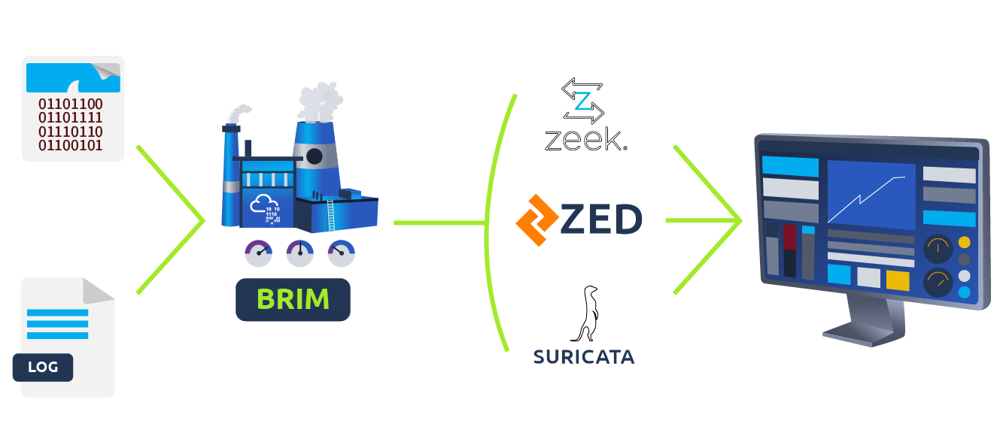

# #13: Brim: Log investigation, pcap analysis and threat hunting

---

## Task 1: Introduction

Brim is an open-source desktop app for analyzing **pcap** files and **log files**.

It focuses on **searching, filtering, and correlation** using Zeek logs and Suricata alerts.

---

## Task 2: What is Brim?



I learned that Brim:

- Supports **pcap files** (from Wireshark, tcpdump, tshark) and **Zeek log files**.
- Provides a **GUI**, making it easier than Zeek (CLI only).
- Cannot sniff live traffic (unlike Wireshark/Zeek).
- Best suited for **medium-to-large pcap files** (not huge multi-GB ones).

Comparison:

- **Wireshark** → best for packet-level details.
- **Zeek** → best for event correlation + scripting.
- **Brim** → in-between, GUI + correlation, but less packet-level power.

---

## Task 3: The Basics

### Step 1: Importing PCAP

1. I opened Brim.
2. On the landing page, I clicked **Choose Files**.
    
    
    
3. I selected **sample.pcap** → it was processed into Zeek logs.
    
    
    

---

### Q1: What is the `qclass_name` of the first DNS log?

1. On the dashboard, I located the **first DNS log** (blue `dns` tag).
    
    
    
2. Right-clicked → **Open Details**.
3. In the **Log Details** panel, I found:
    
    
    

---

### Q2: What is the `duration` of the first NTP log?

1. I clicked on the **first NTP log** (grey `ntp` tag).
2. In Log Details →
    
    
    
    ```
    duration: 0.005
    ```
    

---

### Q3: What is the `reassem_tcp_size` in the STATS log?

1. I found the **STATS log** (green tag).
2. In Log Details →


```
reassem_tcp_size: 540
```

---

## Task 4: Default Queries


Brim has **12 premade queries**. These cover:

- Overall activity
- Windows networking
- Unique connections & transfers
- DNS & HTTP activity
- File activity
- IP subnet stats
- Suricata alerts That completes the **entire Brim room** in clean, professional walkthrough style.

---

### Q1: What is the name of the detected GIF file?

1. I opened **task4-sample-b.pcap**.
2. From the left sidebar, I ran the **File Activity** query.
    
    
    
3. Results showed a `.gif` file:

```
cat01_with_hidden_text.gif
```

---

### Q2: In the conn logfile, how many unique city names are identified?

1. I switched back to **sample.pcap**.
2. Searched only `conn` logs:

```
_path=="conn"
```


1. Extracted city field:

```
_path=="conn" | cut geo.orig.city
```


1. Counted unique cities:

```
_path=="conn" | cut geo.resp.city | sort | uniq -c
```


Result: **2 cities**.

---

### Q3: What is the Signature ID of the “Potential Corporate Privacy Violation” alert?

1. I switched to **task4-sample-b.pcap** again.
2. Used **Suricata Alerts by Category** query.
    
    
    
3. Modified query to also show signature IDs:

```
event_type=="alert" | count() by alert.severity,alert.category,alert.signature,alert.signature_id | sort count
```

1. Found the matching entry →
    
    
    

```
alert.category: Potential Corporate Privacy Violation
alert.signature_id: 2012887
```

---

## Task 5: Use Cases

Brim queries for real investigations. This tasks covers a variety of common analysis queries to use in Brim when you work as security analysts.

- **Find hosts:** Lists all active hosts on the network.
    
    
    
    ```
    _path=="conn" | cut id.orig_h, id.resp_h | sort | uniq
    ```
    
- **Frequent communications (possible backdoors):** Identifies hosts communicating most often, useful for spotting exfiltration or backdoor activities.
    
    
    
    ```
    _path=="conn" | cut id.orig_h, id.resp_h | sort | uniq -c | sort -r
    ```
    
- **Active ports:** Helps uncover hidden activities by analyzing frequently used ports.
    
    
    
    ```
    _path=="conn" | cut id.resp_p, service | sort | uniq -c | sort -r count
    ```
    
- **Long connections:** Flags unusual persistent connections, which may indicate backdoors.
    
    
    
    ```
    _path=="conn" | cut id.orig_h, id.resp_p, id.resp_h, duration | sort -r duration
    ```
    
- **Data transfer analysis:** Helps identify possible data exfiltration or malware distribution.
    
    
    
    ```
    _path=="conn" | put total_bytes := orig_bytes + resp_bytes | sort -r total_bytes | cut uid, id, orig_bytes, resp_bytes, total_bytes
    ```
    
- **Suspicious DNS & HTTP:** Detects suspicious domain requests, useful for spotting C2 communications.
    
    
    
    ```
    _path=="dns" | count() by query | sort -r
    _path=="http" | count() by uri | sort -r
    ```
    
- **Detecting Files:** Investigates suspicious file movements, including malware and sensitive data.
    
    
    
    ```
    filename!=null
    ```
    
- **Analyzing SMB Activity:** Examines potential lateral movement and malicious file sharing.
    
    
    
    ```
    _path=="dce_rpc" OR _path=="smb_mapping" OR _path=="smb_files"
    ```
    
- **Reviewing Security Alerts/ Known Patterns:** Correlates logs from IDS/IPS solutions like Zeek or Suricata.
    
    ```
    event_type=="alert" or _path=="notice" or _path=="signatures"
    ```
    

This structured approach helps security analysts like me to quickly identify and respond to threats using Brim’s powerful filtering and search capabilities.

---