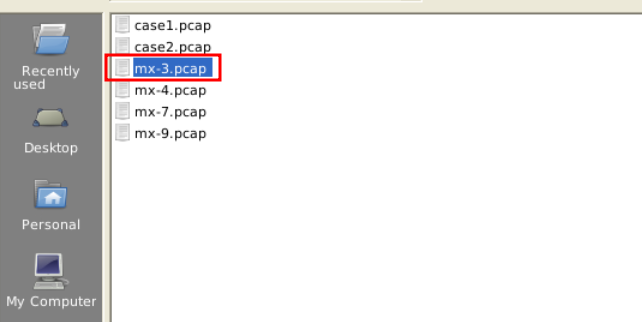

# #10: NetworkMiner: Analyze traffic files and practice network forensics

---

I used **NetworkMiner** to perform network forensics on provided PCAPs. I focused on understanding tool capabilities, loading PCAPs, and extracting basic artifacts (hosts, sessions, files, credentials). This entry documents exactly what I did, why I did it, and how — with the TryHackMe answers included.

**Role:** Incident responder / forensic analyst

**Tools:** NetworkMiner 2.7.2 (GUI)

**Deliverable:** PCAP analysis, extracted artifacts, THM answers

---

# Tool Overview (Part 1)

## Objective

Explore the **Hosts, Sessions, DNS, Credentials panels** and answer PCAP-based questions.

## Steps I performed

1. I loaded `mx-3.pcap`.

- **Hosts tab** showed IPs, MACs, OS fingerprints, sessions.
    
    
    
- **Sessions tab** listed connections + protocols.
    
    
    
- **DNS tab** gave queries and responses.
    
    
    
- **Credentials tab** shows captured credentials.

1. To check total number of frames → 
    
    
    
    
    

1. To check web server of a particular IP? →
    
    
    
2. To see username and passwords we can go to credentials tab? → 
    
    
    

---

# Tool Overview (Part 2)

## Objective

Explore **Files, Images, Parameters, Keywords, Messages, Anomalies panels** and answer PCAP-based questions.

## Steps I performed

1. I loaded `mx-7.pcap`
    
    
    

1. To explore the **Files**, I go to the Files tab, and right click on any file. From there I can click any of these options for more info.
    
    
    

3. To inspect **images**, I go to the images tab.

And by hovering over the image, it shows the file's detailed information (source & destination address and file path).

1. To see extracted **parameters** from investigated pcaps, I simply go to the parameters tab, and easily copy parameters and values easily. 
    
    
    

1. To see **extracted keywords** from the investigated pcaps, this section is very useful in the keywords tab.
    
    
    

1. The **messages** menu shows extracted emails, chats and messages from investigated pcaps.
    
    
    

1. The **anomalies** menu shows detected anomalies in the processed pcap.
    
    
    

## Questions & Answers

1. To check **Linux distro** (frame 63075)? 
    
    
    
2. To find the **source IP** of `ads.bmp.2E5F0FD9.bmp`image ? 
    
    
    

---

1. To find **OS** of any IP address / host? 
    
    
    
2. To know how many **bytes were received** from one address to other through any particular port like port 1065? 
    
    
    
3. To get the **sequence** number of a frame?
    
    
    
4. To find Number of detected content types? 
    
    I need to use the parameters menu here, and look for the parameter name *Content-Type*. I can use the Filter keyword input for time efficiency.
    
    
    
    Unique content types are: text/plain and multipart/mixed. So the number is 2.
    

---

## My final understanding

- **NetworkMiner** is best used for **post-event forensic triage**.
- It quickly shows **hosts, OS, sessions, credentials, files**.
- For deep packet analysis, I’d switch to **Wireshark**.
- For real-time detection, I’d use **Snort**.

---