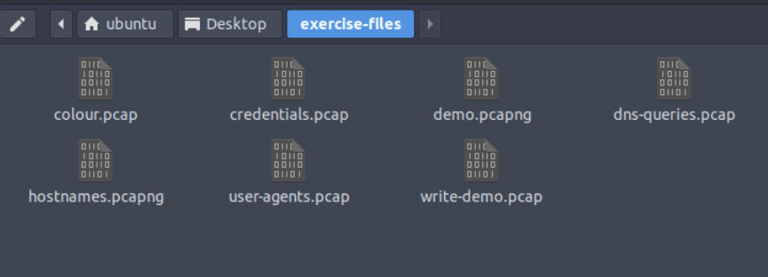

# #19: TShark: Features

---

## Task 1: Introduction

In the first room, *TShark: The Basics*, I covered the fundamentals of TShark, how it operates, and how to use it for traffic capture investigations.

In this room, I focused on **advanced features of TShark**, translating Wireshark GUI features into CLI usage, and analyzing events of interest.

The task files were located in:

```bash
~/Desktop/exercise-files
```



---

## Task 2: Command-Line Wireshark Features I | Statistics I

TShark provides **statistical features** similar to Wireshark, which allow me to get insights about captured packets.

### Step 1: Protocol Hierarchy

I wanted to check the **distribution of protocols** inside a packet capture.

- Command:

```bash
tshark -r write-demo.pcap -z io,phs -q
```

- **Why:** The `z io,phs` option shows protocol hierarchy statistics.
    
    
    
- **How:** It breaks traffic into layers (Ethernet, IP, TCP, HTTP, etc.) and shows **bytes used per protocol**.

---

### Step 2: Packet Length Distribution

Next, I wanted to analyze the **distribution of packet sizes**, which helps in detecting anomalies.

- Command:

```bash
tshark -r write-demo.pcap -z plen,tree -q
```

- **Why:** This shows packets grouped by size (e.g., 0–19, 20–39, 40–79).
- **How:** I checked where the packet falls.
    
    
    

---

### Step 3: Expert Info

I then checked for **Wireshark’s automatic expert analysis**, which highlights important traffic events (e.g., retransmissions, connection attempts).

- Command:

```bash
tshark -r write-demo.pcap -z expert -q
```

- **Why:** `z expert` provides a summary of warnings/errors.
- **How:** The fourth column showed the message.
    
    
    

**Answer:** `Connection establish request (SYN): server port 80`

---

### Step 4: Conversations (Demo File)

Now I wanted to check **IP conversations** in another file.

- Command:

```bash
tshark -r demo.pcapng -z conv,ip -q
```

- **Why:** This shows all communication between IPs.
- **How:** I looked for the IP present in **all IPv4 conversations**.
    
    
    

---

## Task 3: Command-Line Wireshark Features II | Statistics II

Here I explored **protocol-specific statistics**.

### Step 1: IP Hosts with 7 Appearances

- Command:

```bash
tshark -r demo.pcapng -z ip_hosts,tree -q
```

- **Why:** This lists all IP hosts and their counts.
- **How:** I looked for the host with 7 appearances.
    
    
    

**Answer:** `216[.]239[.]59[.]99`

---

### Step 2: Destination Address Percentage

- Command:

```bash
tshark -r demo.pcapng -z dests,tree -q
```

- **Why:** This shows traffic distribution by destination.
- **How:** I searched for the previously found IP and read its percentage.
    
    
    

**Answer:** `6.98%`

---

### Step 3: IP with 2.33% of Destination Traffic

- Same command as above, checked the line with `2.33%`.
    
    
    

**Answer:** `145[.]253[.]2[.]203`

---

### Step 4: DNS Qname Length Average

- Command:

```bash
tshark -r demo.pcapng -z dns,tree -q
```

- **Why:** This shows DNS queries/responses.
- **How:** I read the average `Qname Len` value.
    
    
    

**Answer:** `29.00`

---

## Task 4: Command-Line Wireshark Features III | Streams, Objects & Credentials

This task was about **following streams, exporting objects, and extracting credentials**.

### Step 1: Follow UDP Stream 0

- Command:

```bash
tshark -r demo.pcapng -z follow,udp,ascii,0
```

- **Why:** To track UDP stream 0 and check its node values.
- **How:** At the bottom of the output, I found the value of Node 0.
    
    
    

---

### Step 2: Follow HTTP Stream 1

- Command:

```bash
tshark -r demo.pcapng -z follow,http,ascii,1
```

- **Why:** To see HTTP headers in stream 1.
- **How:** I located the **Referer** field and defanged it.


**Answer:** `hxxp[://]www[.]ethereal[.]com/download[.]html`

---

### Step 3: Extract Credentials

- Command:

```bash
tshark -r credentials.pcap -z credentials -q | nl
```

- **Why:** `z credentials` detects usernames/passwords in cleartext.
    
    
    
- **How:** I counted lines, excluded headers (3) and final line (1)→ total **75**.

---

# Task 5: Advanced Filtering Options | Contains, Matches and Fields

TShark provides advanced filtering options for in-depth packet analysis using the **contains** and **matches** operators, as well as **field extraction**.

### Filtering Options:

- **Contains**
    - Searches for a specific value inside packets.
    - Case-sensitive, similar to Wireshark’s “Find” option.
    - Example:
        
        ```bash
        tshark -r demo.pcapng -Y 'http.server contains "Apache"'
        ```
        
        (Find all HTTP packets where the server contains “Apache”)
        
- **Matches**
    - Searches using regex patterns inside packets.
    - Case-insensitive but has a margin of error in complex queries.
    - Example:
        
        ```bash
        tshark -r demo.pcapng -Y 'http.request.method matches "(GET|POST)"'
        ```
        
        (Find all HTTP packets where the request method is GET or POST)
        

⚠️ Note: Neither `contains` nor `matches` work with integer fields.

### Extracting Fields:

Analysts can extract specific packet data for analysis and correlation.

**Command structure:**

```bash
tshark -r demo.pcapng -T fields -e <field name> -E header=y
```

**Example:** Extract source and destination IPs:

```bash
tshark -r demo.pcapng -T fields -e ip.src -e ip.dst -E header=y -c 5
```

---

### Questions

**Q1. What is the HTTP packet number that contains the keyword “CAFE”?**

- Run filter using `contains`:
    
    ```bash
    tshark -r demo.pcapng -Y 'http.server contains "CAFE"'
    ```
    
    
    
- Output shows packet **27** contains the keyword.

---

**Q2. Filter the packets with “GET” and “POST” requests and extract the packet frame time. What is the first time value found?**

- Use `matches` regex + extract `frame.time`:
    
    ```bash
    tshark -r demo.pcapng -Y 'http.request.method matches "(GET|POST)"' -T fields -e frame.time
    ```
    
    
    
- First time value shown: **May 13, 2004 10:17:08.222534000 UTC**

---

# Task 6: Use Cases | Extract Information

Security analysts should extract **hostnames, DNS queries, and user agents** when investigating suspicious activity.

### 1. Extracting Hostnames

From DHCP packets:

```bash
tshark -r hostnames.pcapng -T fields -e dhcp.option.hostname
```

Clean + organize:

```bash
tshark -r hostnames.pcapng -T fields -e dhcp.option.hostname | awk NF | sort -r | uniq -c | sort -r
```


- `awk NF`: Removes empty lines
- `sort -r`: Sorts in reverse order
- `uniq -c`: Counts occurrences of unique values

---

### 2. Extracting DNS Queries

```bash
tshark -r dns-queries.pcap -T fields -e dns.qry.name | awk NF | sort -r | uniq -c | sort -r
```


Helps find frequently accessed domains.

---

### 3. Extracting User Agents

```bash
tshark -r user-agents.pcap -T fields -e http.user_agent | awk NF | sort -r | uniq -c | sort -r
```


Can reveal **automated tools** (sqlmap, Nmap, wfuzz, etc.).

---

### Questions

**Q1. What is the total number of unique hostnames (hostnames.pcapng)?**

```bash
tshark -r hostnames.pcapng -T fields -e dhcp.option.hostname | awk NF | sort -r | uniq -c | wc -l
```


- Result = **30**

---

**Q2. What is the total appearance count of the “prus-pc” hostname?**


- From sorted list, **prus-pc** = **12 times**

---

**Q3. What is the total number of queries of the most common DNS query (dns-queries.pcap)?**

```bash
tshark -r dns-queries.pcap -T fields -e dns.qry.name | awk NF | sort -r | uniq -c | sort -r
```


- Most common = **db.rhodes.edu**
- Count = **472**

---

**Q4. What is the total number of detected “Wfuzz user agents” (user-agents.pcap)?**

```bash
tshark -r user-agents.pcap -T fields -e http.user_agent | awk NF | sort -r | uniq -c | sort -r
```


- Two wfuzz entries: **9 + 3 = 12**

---

**Q5. What is the “HTTP hostname” of the Nmap scans (defanged format)?**

Run combined extraction:

```bash
tshark -r user-agents.pcap -T fields -e http.user_agent -e http.host | awk NF | sort -r | uniq -c | sort -r
```


- Output shows Nmap Scripting Engine with host **172.16.172.129**
- Defanged: **172[.]16[.]172[.]129**

---

# Task 7: Conclusion

Finished the **TShark: CLI Wireshark Features** room.

- Learned Wireshark → TShark equivalents.
- Used advanced filtering (`contains`, `matches`).
- Extracted hostnames, DNS queries, user agents.

---