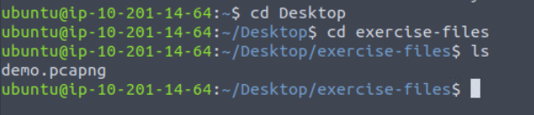

# #18: TShark: The basics

## Task 1: Introduction

TShark is the command-line version of Wireshark. It’s built by the same developers, with nearly all of Wireshark’s features, but designed for **CLI-based packet analysis and automation**. It’s useful to use because:

- It can capture and analyze live traffic like Wireshark.
- It can also act like `tcpdump` for lightweight captures.
- It works great for scripting and automation of packet analysis.

### Learning objectives I set for myself:

- Filtering the traffic with TShark.
- Using Wireshark filters in TShark.
- Automating packet filtering with TShark and CLI tools.

---

## Task 2: Command-Line Packet Analysis Hints | TShark and Supplemental CLI Tools

TShark becomes even more powerful when combined with other CLI tools. I practiced the following helper tools:

- **capinfos** → Summarizes pcap file details.
- **grep** → Searches text patterns.
- **cut** → Extracts columns or fields.
- **uniq** → Removes duplicates.
- **nl** → Adds line numbers.
- **sed** → Edits text streams.
- **awk** → Processes structured text.

### Step 1: Navigating to the exercise files

```bash
cd Desktop/exercise-files/
```



This folder contained the `.pcapng` files for the tasks.

---

### Question: View the details of `demo.pcapng` with `capinfos`. What is the “RIPEMD160” value?

**What I did & why:**

- I wanted to extract metadata about the capture file.
- I used `capinfos`, which gives details like format, encapsulation, hashes, etc.

**Command:**

```bash
capinfos demo.pcapng
```

**Result:**

- Scanned output showed `RIPEMD160` hash.


---

## Task 3: TShark Fundamentals I | Main Parameters I

TShark provides multiple parameters. Here are the most useful ones I practiced:

- `h` → Help page.
- `v` → Show version.
- `D` → List network interfaces.
- `i` → Specify interface to sniff.
- **No parameter** → Capture on default interface.

⚠️ **Note:** Superuser privileges (`sudo`) are required for live sniffing.

---

### Question 1: What is the installed TShark version in the given VM?

**Command:**

```bash
tshark -v
```


**Why:**

- This shows version info and confirms installation.

---

### Question 2: List the available interfaces with TShark. What is the number of available interfaces in the given VM?

**Command:**

```bash
tshark -D
```

**Why:**

- This lists all sniffable interfaces (loopback, Ethernet, WiFi, virtual, etc.).

**Result:**


- The VM displayed **12 interfaces**.

---

## Task 4: TShark Fundamentals I | Main Parameters II

I explored more TShark parameters:

- `r` → Read packets from a file.
- `c` → Limit packet count.
- `w` → Write packets to a new file.
- `V` → Verbose packet details.
- `q` → Suppress output.
- `x` → Show packet bytes in hex + ASCII.

---

### Question 1: Read the `demo.pcapng` file. What are the assigned TCP flags in the 29th packet?

**Command:**

```bash
tshark -r demo.pcapng
```

**Why:**

- Reading from a file avoids sniffing live traffic.
- I scrolled down to packet **29** and checked the flags field.


**Result:**

- Packet 29 had **PSH, ACK** flags set.

---

### Question 2: What is the “Ack” value of the 25th packet?

**Steps I followed:**

- Used the same command as above (`r`).
- Located packet **25**.
- Checked TCP header for **Acknowledgment number**.


---

### Question 3: What is the “Window size value” of the 9th packet?

**Steps I followed:**

- Still inside the same TShark output.
- Located **packet 9**.
- Found the **Window size value** field.


---

## Task 5: TShark Fundamentals II | Capture Conditions

TShark allows setting **automatic capture stop conditions**.

1. **Autostop (`a`)** – Stops capturing after a condition is met:
    - Duration: `tshark -a duration:1` → stops after 1 second
    - Filesize: `tshark -a filesize:10` → stops after 10 KB
    - Files: `tshark -a filesize:10 -a files:3` → stops after 3 files
2. **Ring Buffer Control (`b`)** – Captures in a loop, writing new files and overwriting old ones:
    - Duration: `tshark -b duration:1` → new file every 1 second
    - Filesize: `tshark -b filesize:10` → new file after 10 KB
    - Files: `tshark -b filesize:10 -b files:3` → only 3 files saved, oldest overwritten

> Tip: Ring buffer requires at least one -a autostop parameter to ensure it eventually stops.
> 

---

## Task 6: TShark Fundamentals III | Capture vs Display Filters

1. **Capture Filters (-f)**
    - Applied **before capturing**
    - Determines **which packets are saved**
    - Cannot change live capture filters
2. **Display Filters (-Y)**
    - Applied **after capturing**
    - Filters **visible packets** without changing capture
    - Can be changed dynamically

---

## Task 7: Capture Filters

### Step 1: Prepare Terminals


- **Terminal 1 (Sniffing):**
    
    ```bash
    tshark -f "host 10.10.10.10”
    ```
    
- **Terminal 2 (Generate traffic):**
    
    ```bash
    curl -v 10.10.10.10
    ```
    

### Step 2: Analyze Traffic

1. Count **SYN packets**
    - Look at `Flags` column → SYN flags appear
        
        
        
    - Count packets → **2**
2. Count **packets sent to 10.10.10.10**
    - Look at **Destination IP** in packet lines
        
        
        
    - Count packets → **7**
3. Count **ACK packets**
    - Look at `Flags` column → ACK flags
        
        
        
    - Count → **8**

---

## Task 8: Display Filters

### Step 1: Open demo.pcapng file

- Command to filter IP:

```bash
tshark -r demo.pcapng -Y 'ip.addr == 65.208.228.223' | nl
```


- Look at output → Count → **34 packets**
- `nl` =  to add a numbered list, which make it easier to count the number of packets.

### Step 2: Filter by TCP port 3371

```bash
tshark -r demo.pcapng -Y 'tcp.port == 3371' | nl
```


- Count → **7 packets**

### Step 3: Filter by source IP 145.254.160.237

```bash
tshark -r demo.pcapng -Y 'ip.src == 145.254.160.237' | nl
```


- Count → **20 packets**

### Step 4: Find duplicate packet

- Rerun previous command
    
    
    
- Look for `Dup` in output → Packet number → **37**

---

## Task 9: Conclusion

- TShark is a **command-line Wireshark**
- Supports **capture filters (-f)** and **display filters (-Y)**
- **Autostop (-a)** and **Ring buffer (-b)** allow controlled or continuous captures

---