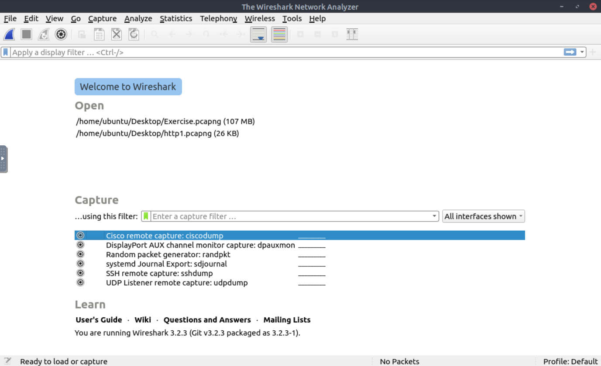

# #15: Wireshark: Analyze protocols and PCAPs

---

## Task 1: Introduction to Wireshark

Wireshark is an **open-source, cross-platform packet analyzer**.

It allows me to:

- **Capture live traffic** (sniff packets directly from my NIC).
- **Inspect saved packet captures (PCAPs)** for investigation.
- **Analyze traffic at different OSI layers** (physical to application).

It is considered one of the most powerful tools for **network troubleshooting and security analysis**.

---

## Task 2: Tool Overview

Wireshark can be used for:

- **Troubleshooting**: E.g., diagnosing dropped packets, latency, congestion.
- **Detecting anomalies**: Spotting rogue devices, unusual port usage, suspicious protocols.
- **Protocol investigation**: Looking at HTTP response codes, DNS queries, FTP uploads, etc.

⚠️ Important: Wireshark is **not an IDS**. It doesn’t generate alerts. Instead, I have to analyze the packets manually and decide if something looks malicious.

---

### Wireshark GUI Sections



When I open Wireshark, I see five major sections:

1. **Toolbar** → Provides quick actions (open file, save, filter, export).
2. **Display Filter Bar** → Where I enter filter queries (e.g., `ip.addr == 192.168.1.1`).
3. **Recent Files** → List of PCAPs I recently worked on.
4. **Capture Filters & Interfaces** → Select NICs before capturing live traffic.
5. **Status Bar** → Shows capture progress, packet count, dropped packets, etc.

---

### How Wireshark Displays Packets

Packets are shown in **three panes**:

1. **Packet List Pane (top):** Summary of each packet → Number, time, source, destination, protocol, info.
2. **Packet Details Pane (middle):** Hierarchical breakdown by protocol layers.
3. **Packet Bytes Pane (bottom):** Raw packet data (Hex + ASCII).

This layered approach maps closely to the **OSI model**.

---

---

### Q1: What is the flag in the capture file comments?

- Steps:
    1. Open `Exercise.pcapng` in Wireshark.
        
        
        
    2. Navigate: `Statistics → Capture File Properties`.
        
        
        
    3. Scroll down → Look for **Capture File Comments** field.
        
        
        
- Why: Analysts often leave metadata or flags here.

### Q2: What is the total number of packets?

- Found in the same properties window (second line).
    
    
    

### Q3: What is the SHA256 hash of the file?

- Scroll up in file properties → check **SHA256 field**.
    
    
    
- Why: Hash confirms file integrity (important in forensics).

---

## Task 3: Packet Dissection

When I click a packet, Wireshark breaks it down into **layers**, which follow the **OSI model**.

- **Frame (Layer 1 – Physical):** Metadata about the entire frame → arrival time, frame length.
- **Data Link (Layer 2):** Source & destination MAC addresses.
- **Network (Layer 3):** IP addresses, TTL, fragmentation info.
- **Transport (Layer 4):** TCP/UDP details → ports, flags, sequence numbers.
- **Application (Layer 5+):** Protocol-specific info → HTTP requests, DNS queries, FTP commands.
- **Application Data:** The actual data exchanged (HTML, XML, files).

Understanding this breakdown is **essential for analyzing malicious traffic** (e.g., C2 traffic often hides in HTTP).

---

### Questions

### Q1: What markup language is used in Packet 38?

- Steps:
    1. Go to **packet 38**.
    2. Expand **Hypertext Transfer Protocol (Application Layer)**.
        
        
        
    3. Look for `Content-Type` or data field.
- Found **XML,** `eXtensible Markup Language (XML)`.

### Q2: What is the arrival date of packet 38?

- Steps:
    1. Expand **Frame (Layer 1)**.
    2. Look at **Arrival Time** field.
        
        
        

### Q3: What is the TTL value?

- Steps:
    1. Expand **Internet Protocol (Layer 3)**.
    2. Locate **Time To Live** field.
        
        
        
- TTL determines how many hops the packet can travel before being dropped.

### Q4: What is the TCP payload size?

- Steps:
    1. Expand **Transport Layer (Layer 4 / TCP Layer)**
    2. Check Timestamps.
        
        
        

### Q5: What is the ETag value?

- Steps:
    1. Expand **HTTP (Application Layer)**.
    2. Look for **ETag field**.
        
        
        
- Why: **ETag** = unique identifier for a resource version. Used by browsers to check if cached content is still valid.

---

## Task 4: Packet Navigation

When analyzing thousands of packets, I need ways to move around efficiently.

### Navigation Features

- **Go to Packet (Ctrl+G):** Jump directly by packet number.
- **Find Packet (Ctrl+F):** Search by string, hex, or display filter.
- **Mark Packets:** Highlight interesting packets (not saved if file closed).
- **Packet Comments:** Permanent notes saved inside PCAP.
- **Export Packets:** Save specific packets separately for focused analysis.
- **Export Objects:** Extract transferred files (e.g., HTTP images, SMB files).
- **Expert Info:** Wireshark flags anomalies (errors, warnings, suspicious events).

---

### Questions

### Q1: Search for string `r4w` – What is artist 1?

- Steps:
    1. Press `Ctrl+F`.
    2. Search for string `r4w`.
    3. Found in **packet 33790 and packet 43362**  inside HTML body.
        
        
        

### Q2: Packet 12 comments → what is the answer?

- Steps:
    1. Jump to packet 12.
    2. Open `Edit → Packet Comment` OR look for green-highlighted comment.
        
        
        
    3. Instruction said: go to packet 3975 → export JPEG → run `md5sum <file>` in terminal.
        
        
        
        
        
    4. Generated hash = `911cd574a42865a956ccde2d04495ebf`.

### Q3: What is the alien’s name in `.txt` file?

- Steps:
    1. Search for `.txt`.
    2. Found `GET /note.txt`.
        
        
        
        
        
    3. Open response frame → double click and then scroll till you see Line-based text data.
        
        
        
        The alien said: `PACKETMASTER`
        

### Q4: Number of warnings in Expert Info?

- Steps:
    1. Open `Analyze → Expert Information`.
        
        
        
    2. Count warnings.
        
        
        
        **Answer:** `1636`
        

---

## Task 5: Packet Filtering

Wireshark supports **two types of filters**:

1. **Capture Filters (set before capture):** Limit traffic saved. Example:
    
    ```bash
    port 80
    ```
    
    → Capture only HTTP traffic.
    
2. **Display Filters (applied after capture):** Hide/show specific packets. Example:
    
    ```
    http.request.method == "GET"
    ```
    
    → Show only HTTP GET requests.
    

---

### Filter Tools

- **Apply as Filter:** Right-click field → instantly filter.
- **Prepare as Filter:** Right-click → edit before applying.
- **Conversation Filter:** Show traffic between two endpoints.
- **Colourise Conversation:** Highlight packets instead of filtering.
- **Follow Stream:** Reconstruct conversation (e.g., HTTP/SMTP).
- **Apply as Column:** Add field as column for quick analysis.

---

### Questions

### Q1: Packet 4 – Apply HTTP as filter

- Steps:
    1. Right-click **Hypertext Transfer Protocol** → Apply as Filter → Selected.
        
        
        
    2. Filter applied = `http`.
        
        
        

### Q2: Number of displayed packets after filter

- Steps:
    1. Look at **bottom-right status bar**.
        
        
        

### Q3: Packet 33790 – Follow HTTP Stream

- Steps:
    1. Right-click packet 33790 → Follow → HTTP Stream.
        
        
        
    2. See all artist names in HTML response.
        
        
        

### Q4: Name of second artist

- From stream output, second artist listed = `Blad3`.
    
    
    

---

## Task 6: Conclusion

By completing this room, I learned:

- How to **open, navigate, and analyze PCAP files** in Wireshark.
- How to extract **metadata** (hashes, comments, timestamps).
- How to dissect packets using the **OSI model**.
- How to **search, filter, and follow streams** effectively.
- How to **extract files** and validate them with hashes.

This was a strong introduction to packet analysis.

Next step → move on to **Wireshark: Packet Operations** for deeper protocol-level investigations.

---