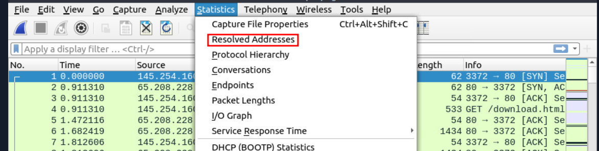

# #16: Wireshark: Packet Operations

---

# Packet Analysis Fundamentals

In this project, I explored advanced features of **Wireshark** to analyze packet-level details. I worked with **Wireshark statistics, filters, operators, and functions** to investigate captured traffic. This is the second room of the Wireshark trio (the first one being *Wireshark: The Basics*).

---

# Task 1: Introduction

In the first Wireshark room, I practiced the basics — learning how Wireshark operates and how to investigate traffic captures.

In this room, I focused on **advanced packet-level analysis** using Wireshark’s built-in statistics and filtering functions.

---

# Task 2: Statistics | Summary

The **Statistics menu** in Wireshark provides quick insights into traffic patterns. I explored different sections here:

- **Resolved Addresses** – lists IPs and DNS hostnames in the capture. Helps identify accessed domains/resources.
- **Protocol Hierarchy** – shows breakdown of protocols and percentages.
- **Conversations** – shows traffic exchanges between endpoints.
- **Endpoints** – focuses on unique endpoints with extra details like MAC vendor or city.
- **Name Resolution** – converts MAC, IP, and ports into readable names (optional).
- **GeoIP Mapping** – geolocates IPs if MaxMind database is set up.

---

### Q1: Investigate the resolved addresses. What is the IP address of the hostname starting with “bbc”?

1. I navigated to **Statistics → Resolved Addresses**.
    
    
    
2. A new window appeared listing IP/MAC addresses and their resolved hostnames.
3. I searched for entries starting with `bbc`.
    
    
    
4. Found the resolved hostname → `bbc` → IP address **199.232.24.81**.

---

### Q2: What is the number of IPv4 conversations?

1. I opened **Statistics → Conversations**.
    
    
    
2. In the tabbed window, I selected the **IPv4 tab**.
3. At the top, I saw the number of IPv4 conversations listed.
    
    
    
4. The value was **435**.

---

### Q3: How many bytes (k) were transferred from the “Micro-St” MAC address?

1. I opened **Statistics → Endpoints**.
    
    
    
2. To identify Micro-St, I enabled **Name Resolution** in the Endpoints window.
    
    
    
3. Then I located the MAC vendor **Micro-St**.
4. In the **Bytes column**, I saw the transferred value → **7474 kB**.
    
    
    

---

### Q4: What is the number of IP addresses linked with “Kansas City”?

1. Still in the **Endpoints window**, I switched to the **IPv4 tab**.
2. There was a column called **City**.
3. I sorted the City column alphabetically and scrolled.
4. Found multiple entries under **Kansas City** → exactly **4**.
    
    
    

---

### Q5: Which IP address is linked with “Blicnet” AS Organisation?

1. In the **Endpoints window**, I looked at the **AS Organization column**.
2. I sorted the column alphabetically.
3. Found **Blicnet** listed with its IP.
4. IP address was **188.246.82.7**.

---

# Task 3: Statistics | Protocol Details

Wireshark allows narrowing stats by **protocol type**. Useful when I want detailed visibility:

- **IPv4/IPv6 Statistics** – shows packet distribution by IP versions.
- **DNS Statistics** – shows queries, responses, and codes.
- **HTTP Statistics** – shows request/response activity.

---

### Q1: What is the most used IPv4 destination address?

1. I went to **Statistics → IPv4 Statistics → Destinations and Ports**.
    
    
    
2. Sorted by the **Count column** (highest at the top).
3. The top destination IP was **10.100.1.33** with **29387 packets**.
    
    
    

---

### Q2: What is the max service request-response time of the DNS packets?

1. I opened **Statistics → DNS**.
    
    
    
2. Found the **Service Stats** section.
3. Looked under the **Request-Response Time (secs)** row.
4. The **Max val** column showed → **0.467897** seconds.
    
    
    

---

### Q3: What is the number of HTTP requests accomplished by `rad.msn.com`?

1. I went to **Statistics → HTTP → Load Distribution**.
    
    
    
2. Sorted the **Topic/Item column** alphabetically.
3. Found the entry for `rad.msn.com`.
4. The requests were split across two rows → **24 + 15 = 39** requests.
    
    
    

---

# Task 4: Packet Filtering | Principles

Wireshark supports two types of filters:

- **Capture Filters** – applied before capturing traffic. Static and unchangeable after capture. Risky because wrong filters can miss evidence. Syntax: `tcp port 80`.
- **Display Filters** – applied after capture. Flexible and powerful (supports 3000+ protocols). Syntax: `tcp.port == 80`.

Operators used in filters:

- **Comparison Operators** → `==`, `!=`, `>`, `<`, `>=`, `<=`.
- **Logical Operators** → `AND (&&)`, `OR (||)`, `NOT (!)`.
- **Toolbar Color Codes** → Green = valid filter, Red = invalid, Yellow = unreliable.

---

---

# Task 5: Packet Filtering | Protocol Filters

In this task, I practiced using Wireshark filters for **network (IP), transport (TCP/UDP), and application protocols (HTTP/DNS)**. These filters let me isolate packets of interest and investigate them at different OSI layers.

---

### Q1: What is the number of IP packets?

1. I applied the **display filter**:
    
    
    
    ```
    ip
    ```
    
    This filter shows **all IP packets** while removing everything else.
    
    
    

---

### Q2: What is the number of packets with a TTL value less than 10?

1. TTL (Time-to-Live) is a field in the IP header that decreases as packets pass through routers. Low TTL values can indicate packets close to expiration.
2. I applied the filter:
    
    ```
    ip.ttl < 10
    ```
    
    1. This displayed packets where TTL is less than 10.
        
        
        

---

### Q3: What is the number of packets which use TCP port 4444?

1. Ports identify which application/service is communicating.
2. I applied this filter:
    
    ```
    tcp.port == 4444
    ```
    
    
    
    1. This showed all packets using TCP port 4444 (both source and destination).

---

### Q4: What is the number of HTTP GET requests sent to port 80?

1. I wanted only **HTTP GET requests** where the destination is port 80 (standard HTTP).
2. I combined two filters:
    
    ```
    http.request.method == "GET" and tcp.dstport == 80
    
    ```
    
    
    
    1. This filtered only web requests going to port 80.

---

### Q5: What is the number of type A DNS Queries?

1. In DNS, **A queries** request IPv4 addresses.
2. The filter for A queries is:
    
    ```
    dns.qry.type == 1
    ```
    
3. Since the question asked only for **queries** (not responses), I excluded responses:
    
    ```
    dns.qry.type == 1 and dns.flags.response == 0
    ```
    
    
    
    ---
    

# Task 6: Advanced Filtering

Here I learned advanced filter operators and functions in Wireshark:

- **contains** → looks for specific value (case-sensitive).
- **matches** → regex search (case-insensitive).
- **in** → search within a set of values.
- **upper/lower** → convert text for case handling.
- **string()** → convert non-strings (like numbers) into strings for flexible filters.

I also explored **bookmarks, filter buttons, and profiles** to make frequent filters easier to reuse.

---

### Q1: Find all Microsoft IIS servers. What is the number of packets that did not originate from port 80?

1. To find IIS servers, I filtered HTTP server headers:
    
    ```
    http.server contains "IIS" and !tcp.srcport == 80
    ```
    
2. This found IIS packets where source port was **not 80**.
    
    
    

---

### Q2: Find all Microsoft IIS servers. What is the number of packets that have version 7.5?

1. I checked HTTP headers where server info is shown to find out how the service versions are formatted:
    
    
    
2. Right-clicked the value → Apply as Filter.
3. Filter I got:
    
    
    
    Edited it to only show the ones that have version 7.5.
    
    ```
    http.server == "Microsoft-IIS/7.5"
    ```
    
    
    
    Result: **71**
    

---

### Q3: What is the total number of packets that use ports 3333, 4444, or 9999?

1. I used the **in operator** to group multiple ports:
    
    ```
    tcp.port in {3333 4444 9999}
    ```
    
    
    

---

### Q4: What is the number of packets with even TTL numbers?

1. TTL values are integers, but to filter even ones, I converted TTL into a string.
2. Then I used regex to match even digits:
    
    ```
    string(ip.ttl) matches "[24680]$"
    ```
    
    **Answer:** 77289
    

---

### Q5: Change the profile to “Checksum Control”. What is the number of “Bad TCP Checksum” packets?

1. I changed my Wireshark profile in the bottom right → selected **Checksum Control**.
    
    
    
2. Bad TCP checksum packets are flagged red/black in the info column.
    
    
    
3. I filtered by right-clicking checksum field → Apply as Filter.
    
    
    
    
    
    Result: **34185**
    

---

### Q6: Use the existing filtering button to filter the traffic. What is the number of displayed packets?

1. I noticed a pre-made filter button next to the display filter input → `gif/jpeg with http-200`.
    
    
    
2. This filter was:
    
    ```
    (http.response.code == 200) && (http.content_type matches "image(gif||jpeg)")
    ```
    
3. When applied, it displayed packets related to successful HTTP responses with GIF/JPEG images.
    
    
    
    Result: **261**
    

---

# Task 7: Conclusion

I successfully completed the **Wireshark: Packet Operations** room.

- Learned to use **statistics tools** (resolved addresses, endpoints, conversations).
- Practiced **basic and advanced filtering** at IP, TCP/UDP, and application layers.
- Used operators like `contains`, `matches`, `in`, and functions like `string()`.
- Applied **profiles, buttons, and bookmarks** to speed up analysis.

This project strengthened my ability to filter and analyze traffic at the packet level using Wireshark.

---