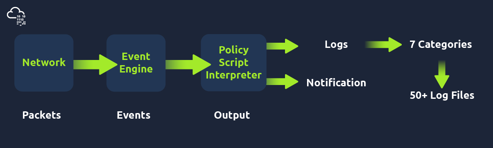

# #11: Zeek: Network monitoring and threat detection

## Introduction

Zeek (formerly Bro) is an open-source network monitoring tool. Unlike traditional IDS/IPS that focus only on signatures or alerts, Zeek passively analyzes traffic and produces detailed logs that can be used for **forensics, threat hunting, and network monitoring**.

Before starting, I reviewed prerequisites: Linux basics and networking fundamentals (ports, protocols, traffic flow).

---

## Network Security Monitoring and Zeek

### What I learned

- **Network Monitoring**: Focuses on IT assets, performance, and troubleshooting.
- **Network Security Monitoring (NSM)**: Goes deeper — looks for anomalies, suspicious activity, and supports SOC workflows.
- **Zeek**: A framework that records traffic into structured logs.
- **Snort vs Zeek**: Snort is better for real-time prevention, Zeek is better for detailed forensic investigation.

### Zeek Architecture



- **Event Engine**: Reads packets, extracts metadata (IPs, ports, protocols, sessions, files).
- **Policy Script Interpreter**: Uses Zeek scripts to correlate events and apply custom logic.

### Zeek Frameworks

Zeek includes frameworks like Logging, File Analysis, Intelligence, Notice, GeoLocation, etc.

In this room, I mostly worked with the **Logging Framework**.

---

### Using Zeek

### 1. Running Zeek as a Service (Live Monitoring)

ZeekControl is the module used for live monitoring:


```bash
sudo zeekctl
[ZeekControl] > start   # Start Zeek service
[ZeekControl] > status  # Check service status
[ZeekControl] > stop    # Stop Zeek service
```

Alternatively, commands can be run directly:

```bash
sudo zeekctl start
sudo zeekctl status
sudo zeekctl stop
```

### 2. Processing PCAP files (Offline Analysis)

To analyze a PCAP file:

```bash
zeek -C -r sample.pcap
```

- `r`: read a PCAP file.
- `C`: ignore checksum errors.

Logs are saved in the current directory (e.g., `conn.log`, `dns.log`, `dhcp.log`).

---

### Questions

---

**Q1: Investigate the “sample.pcap” file. What is the number of generated alert files?**

- First, I made sure I was in the correct folder:
    
    ```bash
    cd /home/ubuntu/Desktop/Exercise-Files/TASK-2
    ```
    
- Then I ran Zeek on the PCAP:
    
    ```bash
    zeek -C -r sample.pcap
    ```
    
- Zeek didn’t print anything directly, but it generated log files. Running `ls` showed **8 log files** were created.


---

## Zeek Logs


When processing a PCAP, Zeek creates different logs:

- **Network Logs:** `conn.log`, `dns.log`, `http.log`, `ssl.log`
- **File Logs:** `files.log`, `x509.log`
- **Detection Logs:** `intel.log`, `notice.log`
- **Observation Logs:** `known_hosts.log`, `software.log`
- **Diagnostic Logs:** `stats.log`, `stderr.log`

Each log has a **UID** field so events can be correlated.

### Workflow I used for log analysis:

1. Look at general logs first (`conn.log`, `files.log`).
2. Narrow down by protocol (`dns.log`, `http.log`).
3. Check detection logs (`notice.log`, `intel.log`).
4. Summarize using observation logs.

### Tools I used

- Linux CLI: `cat`, `grep`, `sort`, `uniq`.
- `zeek-cut`: extracts specific fields from Zeek logs.

Example:

```bash
cat conn.log | zeek-cut uid proto id.orig_h id.orig_p id.resp_h id.resp_p
```

---

### Questions

**Q1: Investigate the dhcp.log file. What is the available hostname?**

- I ran:
    
    ```bash
    cat dhcp.log | zeek-cut host_name
    ```
    
    
    
- Output showed the hostname `Microknoppix`.

**Answer:** **Microknoppix**

---

**Q2: Investigate the dns.log file. What is the number of unique DNS queries?**

- First, I listed all DNS queries:
    
    ```bash
    cat dns.log | zeek-cut query
    ```
    
- Then I counted unique entries with:
    
    ```bash
    cat dns.log | zeek-cut query | sort | uniq
    ```
    
    
    
- There were **2 unique DNS queries**.

---

**Q3: Investigate the conn.log file. What is the longest connection duration?**

- I extracted durations:
    
    ```bash
    cat conn.log | zeek-cut duration
    
    ```
    
- To sort by highest value:
    
    ```bash
    cat conn.log | zeek-cut duration | sort -nr | head -1
    ```
    
    
    
- `sort` → sorts lines of text.
- `n` → **numeric sort** (treats values as numbers, not text).
- `r` → **reverse order** (biggest first → smallest last).

So together:

`sort -nr` = **sort numbers in descending order**.

- The longest duration was `332.319364`.

---

## CLI Kung-Fu Recall

This task reinforced common Linux CLI commands useful for Zeek logs.

Some examples

```bash
history                   # view history
!10                       # run command #10 from history
cat file.txt | grep 'X'   # search for keyword
cat file.txt | sort | uniq -c   # unique count
cat conn.log | zeek-cut uid src_addr dst_addr
```

---

## 1. Zeek Signatures

### Objective

Learn how to create and load Zeek signatures, use them to detect suspicious traffic, and investigate logs generated by matches.

---

### Steps I Performed

1. **Changed into the task folder**
    
    ```bash
    cd ~/Desktop/Exercise-Files/TASK-5
    ```
    
    - **Why:** This folder contains the required `http`, `ftp` folder. I will go to the `http` folder.

---

### Part 1: Creating and Testing HTTP Signature

1. **Opened `http-password.sig` for editing**
    - **Why:** I had to create the HTTP signature provided in the task.
2. **Added the following signature**:
    
    ```
    signature http-password {
        ip-proto == tcp
        dst-port == 80
        payload /.*password.*/
        event "Cleartext Password Found!"
    }
    ```
    
    
    
    - **What this does:** Looks for any HTTP traffic (`dst-port 80`) containing the word *password* in its payload.
    - **Why:** Detects cleartext password leaks in web requests.
3. **Ran Zeek with the signature against the PCAP**
    
    ```bash
    zeek -C -r http.pcap -s http-password.sig
    ```
    
    - **Why:** `C` ignores checksum errors, `r` processes the PCAP, and `s` loads my custom signature file.
    - Now I got 4 new log files, including the `signature.log` file which I needed.
    
    
    
4. **Checked signature matches in the logs**
    
    ```bash
    cat signatures.log | zeek-cut src_addr
    ```
    
    
    
    - This showed the **source IP of the first event**.

---

### Part 2: Finding the Source Port of Second Event

1. **Extracted multiple columns**
    
    ```bash
    cat signatures.log | zeek-cut src_addr src_port
    
    ```
    
    
    

---

### Part 3: Packets Sent/Received from Source Port 38706

1. **Inspected connection logs**
    
    ```bash
    cat conn.log | zeek-cut id.orig_p orig_pkts resp_pkts
    ```
    
    
    
    - Then checked values for port **38706**.
    - **Result:** Sent packets = 11, Received packets = 9 → Total = 20.

---

### Part 4: FTP Brute-Force Signatures

1. **Went to the ftp folder and opened `ftp-bruteforce.sig` and added two rules:**
    
    ```
    signature ftp-username {
        ip-proto == tcp
        ftp /.*USER.*/
        event "FTP Username Input Found!"
    }
    
    signature ftp-brute {
        ip-proto == tcp
        payload /.*530.*Login.*incorrect.*/
        event "FTP Brute-force Attempt!"
    }
    ```
    
    
    
    - **Why:** Detects FTP login attempts (`USER`) and brute-force failures (`530 Login incorrect`).
2. **Ran Zeek with FTP PCAP**
    
    ```bash
    zeek -C -r ftp.pcap -s ftp-bruteforce.sig
    ```
    
    - We got some new files
        
        
        
3. **Checked notice log for unique events**
    
    ```bash
    cat notice.log | zeek-cut uid | sort | uniq -c | wc -l
    ```
    
    
    
    - `uniq` removes duplicate adjacent lines (so you often use it with `sort`).
    - `c` = **prefix each output line with a count** of how many times it appeared.
    - `wc -l` → count how many lines matched.
    - `wc` = **word count** command.
    - `l` = line count.
4. **Counted brute-force signature matches**
    
    ```bash
    cat notice.log | grep "FTP Brute-force Attempt" | wc -l
    ```
    
- `grep`→ keep only lines that contain `"FTP Brute-force Attempt"`.
- `wc -l` → count how many lines matched.


---

## 2. Zeek Scripts (Fundamentals)

### Objective

Understand Zeek’s scripting language, run custom `.zeek` scripts on PCAPs, and extract DHCP info.

---

### Steps I Performed

1. **Changed into the task folder**
    
    ```bash
    cd ~/Desktop/Exercise-Files/TASK-6/smallflow
    ```
    

---

### Part 1: Running DHCP Script on SmallFlows

1. **Executed Zeek with the script**
    
    ```bash
    zeek -C -r smallFlows.pcap dhcp-hostname.z
    ```
    
    
    
    - **Why:** The script extracts DHCP hostnames from the PCAP.
    - And after reading the pcap file we get 12 new log files.
2. **Read DHCP log for hostname/domain**
    
    ```bash
    cat dhcp.log | zeek-cut host_name domain
    ```
    
    
    

---

### Part 2: Unique Hostnames in BigFlows

First I will have to go to the `bigflow` folder at

```jsx
cd /Desktop/Exercise-Files/TASK-6/bigflow
```

1. **Ran script on bigFlows PCAP**
    
    ```bash
    zeek -C -r bigFlows.pcap dhcp-hostname.zeek
    ```
    
    This took a bit longer to run. After a minute or so it was done. 
    
2. **Counted unique hostnames**
    
    ```bash
    cat dhcp.log | zeek-cut host_name | sort | uniq | wc -l
    ```
    
    
    
    - **Note:** One hostname was empty (), but still counted. So actual answer is 17.

---

### Part 3: Identified Domain in DHCP

1. **Extracted domain values**
    
    ```bash
    cat dhcp.log | zeek-cut domain
    ```
    
    
    

---

# Task 7: Zeek Scripts | Scripts and Signatures

## Understanding Zeek Scripts

- **Events**: `zeek_init` (runs at start) and `zeek_done` (runs at end).
    
    ```
    event zeek_init() { print ("Started Zeek!"); }
    event zeek_done() { print ("Stopped Zeek!"); }
    ```
    
- Zeek scripts process traffic → generate logs.
- Example: `new_connection` event prints connection details.

---

### Q1: New connections (TASK-7/101)

1. I moved into the `TASK-7/101` directory.
2. Ran script `103.zeek` against `sample.pcap`:
    
    ```bash
    zeek -C -r sample.pcap 103.zeek
    ```
    
    
    
    → Output showed “New Connection Found!” many times.
    
3. To count:
    
    ```bash
    zeek -C -r sample.pcap 103.zeek | grep "New Connection Found!" | wc -l
    ```
    
    
    
    - `wc` = **word count** (but it can also count characters, bytes, and lines).
    - `l` = **line count** only.
    - `wc -l` prints the number of lines.

---

### Q2: Signature hits (TASK-7/201)

1. In `TASK-7/201`.
2. Ran script and signature together:
    
    ```bash
    zeek -C -r ftp.pcap -s ftp-admin.sig 201.zeek | wc -l
    ```
    
    
    
    → Counted number of signature hits.
    
    → Result: **1401**.
    

---

### Q3: Administrator detections

1. Checked `signatures.log` for “USER administrator”:
    
    ```bash
    cat signatures.log | grep "USER administrator" | wc -l
    ```
    
    → Result: **731**.
    

---

### Q4: Loaded scripts (TASK-7 local)

1. Ran Zeek with **all local scripts**:
    
    ```bash
    zeek -C -r ftp.pcap local
    ```
    
    I used the command below instead, because counting all lines that included a string path (all scripts are nested in the /opt/ main directory.
    
2. Counted actual scripts (filtering out comments):
    
    ```bash
    cat loaded_scripts.log | grep "/opt/" | wc -l
    ```
    
    
    
    → Result: **498**.
    

---

### Q5: Brute-force detections (TASK-7/202)

Investigate the ftp-brute.pcap file with **"/opt/zeek/share/zeek/policy/protocols/ftp/detect-bruteforcing.zeek"** script. 

1. Ran Zeek with FTP brute-force detection script:
    
    ```bash
    zeek -C -r ftp-brute.pcap /opt/zeek/share/zeek/policy/protocols/ftp/detect-bruteforcing.zeek
    ```
    
2. Opened `notice.log`:
    
    ```bash
    cat notice.log
    ```
    
    → Only **2 entries**.
    

---

# Task 8: Zeek Scripts | Frameworks

## File Framework

- `hash-all-files.zeek`: generates MD5, SHA1, SHA256.
- `extract-all-files.zeek`: extracts files into `extract_files/`.

## Intelligence Framework

- Uses feeds (like `zeek_intel.txt`).
- Detects anomalies based on known intel.

---

### Q1: Intel source (TASK-8)

1. Ran script on `case1.pcap`:
    
    ```bash
    zeek -C -r case1.pcap intelligence-demo.zeek
    ```
    
2. Checked intel.log:
    
    ```bash
    cat intel.log | zeek-cut seen.where
    ```
    
    
    
    → Second row = **IN_HOST_HEADER**.
    

---

### Q2: Downloaded .exe file

1. Searched `http.log` for `.exe`:
    
    ```bash
    cat http.log | grep "exe"
    ```
    
    
    
    → Found `knr.exe`.
    

---

### Q3: MD5 hash of .exe

1. Ran script:
    
    ```bash
    zeek -C -r case1.pcap hash-demo.zeek
    ```
    
2. Looked into `files.log`:
    
    ```bash
    cat files.log | zeek-cut mime_type md5
    ```
    
    
    
    → MD5 for `x-dosexec` = **cc28e40b46237ab6d5282199ef78c464**.
    

---

### Q4: Extracted text file

1. Extracted files:
    
    ```bash
    zeek -C -r case1.pcap file-extract-demo.zeek
    
    # Then cd into the extract_files folder:
    cd extract_files
    
    # Now to find out which file is the text file: 
    file * | nl
    ```
    
    
    
    ### `file *`
    
    - The `file` command tells you **what type of file** each file is (text, image, binary, script, etc.).
    - expands to "all files in the current directory".
    
    → Found first file = text file.
    
2. Read it:
    
    ```bash
    cat extract-1561667874.743959-HTTP-Fpgan59p6uvNzLFja
    ```
    
    → Content: **Microsoft NCSI**.
    

---

# Task 9: Zeek Scripts | Packages

## Zeek Package Manager (zkg)

- Install: `zkg install <pkg>`
- List: `zkg list`
- Remove: `zkg remove <pkg>`
- Update: `zkg upgrade`

### Example Packages

- **zeek-sniffpass** → Detects cleartext passwords.
- **geoip-conn** → Adds geolocation info to connections.

---

### Q1: Username with most hits

1. In `cleartext-pass` folder.
2. Ran:
    
    ```bash
    zeek -Cr http.pcap zeek-sniffpass
    cat http.log | zeek-cut post_username
    ```
    
    
    
    → Found `BroZeek` 3 times.
    

---

### Q2: City name (geoip-conn)

1. In `geoip-conn` folder.
2. Ran:
    
    ```bash
    zeek -Cr case2.pcap geoip-conn
    cat conn.log
    ```
    
    
    
    → Found city = **Chicago**.
    

---

### Q3: IP for the city

- From same log row → IP = **23.77.86.54**.

---

### Q4: HTTP status codes (sumstats-counttable)

1. Ran:
    
    ```bash
    zeek -Cr case2.pcap sumstats-counttable.zeek
    ```
    
    
    
    → Saw **4 different status codes**.
    

---